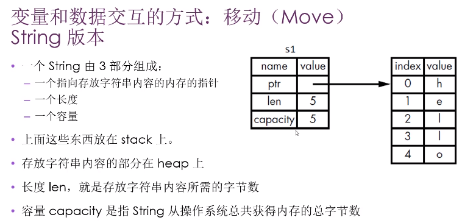
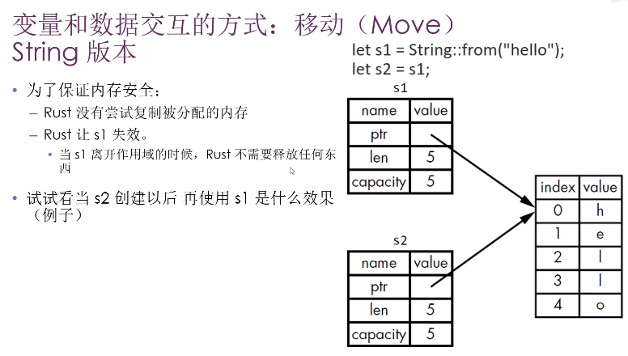
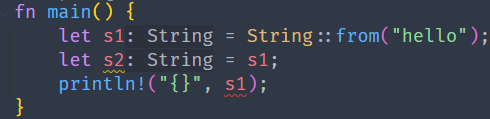
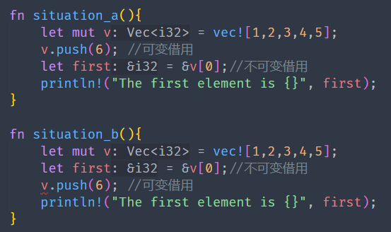

# Rust入门

* ***Fira Code，等宽的编程连字字体***
* Rust 的缩进是4个空格，不是tab
* println! 是一个Rust macro(宏)
  * 如果是函数则没有!

## Cargo

> Rust的构建系统和包管理工具

1. cargo --version
2. 创建项目: cargo new hello_cargo
3. 构建项目: cargo build
4. 构建运行: cargo run
5. 发布构建: cargo build --release

## TOML

> TOML 这个名字是 Tom's Obvious, Minimal Language（汤姆的浅显的、极简的语言）的首字母略写词

## 语法

* 定义常量
  * `const MAX_POINT:i32 = 1099;`
    * 变量名大写
    * 指定类型
* shadowing
  * 使用相同的名字声明新的变量，新的变量就会shadow之前声明的同名变量
* 标量类型
  * 整数类型
  * 浮点类型
  * 布尔类型
  * 字符类型
* 复合类型
  * 长度固定
  * Tuple
    * 将多个类型的多个值放在一个类型里
    * ```rust
      let tup_set: (i32, f64, u8) = (200, 4.4, 1);
      println!("{} - {} - {}", tup_set.0, tup_set.1, tup_set.2);

      let (x, y, z) = tup_set;
      println!("{} - {} - {}", x, y, z);
      ```
  * 数组
    * 如果想让数据存放在栈上而不是堆上，或者保证有固定数量的元素时用数组
    * 数组没有Vector（标准库提供的）灵活
    * Vector长度可以改变
    * ```rust
      let a = [3;5];
      let b = [3,3,3,3,3];
      let first = a[0];
      ```
* 函数
  * 用关键字 fn
  * snake case
  * ```rust
    fn ano_func(x: i32) { //parameter 必须指定参数类型
        println!("{}", x);
    }
    //
    ano_func(3); //argument

    ///////////////////////////
    fn main() {
        let x = plus_five(4);
        println!("{}", x);
    }

    fn plus_five(x: i32) -> i32 {
        x + 5  //这里不能有分号，否则意义会变
    }
    ```
* 注释
* 控制流
  * if表达式
    * 根据条件（bool）执行不同代码分支
    * 与条件相关联的代码块叫分支（arm）
  * 循环
    * loop
    * while
    * for

## 所有权

* Rust的核心特性就是所有权
* 所有程序在运行时都必须管理它们使用计算机内存的方式
  * 有些语言有垃圾手机机制
  * 有些语言，程序员必须显示地分配和释放内存
* Rust采用另一种方式
  * 通过一个所有权系统来管理，其中包含一组编译器在编译时检查的规则
  * 当程序运行时，所有权特性不会减慢程序的运行速度
* 所有权解决的问题
  * 跟踪代码的那些部分正在使用heap的那些数据
  * 最小化heap上的重复数据量
* 内存和分配
  * 当拥有它的变量走出作用域时，内存会立即自动的交还给操作系统
  * **drop函数**
* 变量和数据交互的方式
  * move
    * 多个变量可以与同一个数据使用一种独特的方式来交互
    * ```
      let x = 5;
      let y = x; //创建了一个x的副本，并绑定到y上
      ```
    * String堆对象

      * 三部分组成（在stack上）
        * 指向存放字符串内容的内存指针（字符串内容在heap上）
        * 一个长度（存放字符串内容所需的字节数）
        * 一个容量（String从操作系统总共获得的内存的总字节数）
        * 
        * 
        * 
  * 你也许会将复制指针、长度、容量视为浅拷贝，但由于Rust 让s1失效了，所以我们用一个新的术语：Move
  * Rust不会自动创建数据的深拷贝
  * 如果想对heap上面的string数据进行深度拷贝，而不仅仅是stack上的数据，可以使用clone方法
* stack上的数据：复制
  * Copy trait，可以用于像整数这样完全存放在stack上面的类型
  * 如果一个类型实现了copy这个trait，那么旧的变量在赋值后仍然可用
  * 如果一个类型或者该类型的一部分实现了Drop trait，那么Rust不允许让它再去实现copy trait
* 一些拥有Copy trait的类型
  * 任何简单标量的组合类型都可以**是**copy的
  * 任何需要分配内存或某种资源的都**不是**copy的
  * 拥有copy trait的类型
    * 所有的整数类型
    * bool
    * char
    * 所有的浮点类型
    * Tuple，如果其所有的字段都是copy的
      * （i32，i32）是
      * （i32，String）不是

## 所有权与函数

> 将值传递给函数将发生***移动***或***复制***

## 返回值与作用域

> 函数在返回值的过程中同样会发生所有权的转移

## 如何让函数使用某个值，但不获得其所有权

```rust
fn main() {
    let s1 = String::from("hello");
    let (s2, len) = calculate_length(s1);
    println!("The length of '{}' is {}", s2, len);
}

fn calculate_length(s: String) -> (String, usize) {
    let len = s.len();
    (s, len)
}
```

> 推荐方式

```rust
fn main() {
    let s1 = String::from("hello");
    let len = calculate_length(&s1);
    println!("The length of '{}' is {}", s1, len);
}

fn calculate_length(s: &String) -> usize {
    s.len()
}
```

* 引用和借用
  * &符号表示引用，允许引用某些值而不取得其所有权
  * 把引用作为函数参数这个行为叫做借用

## 字符串

* 切片
  * > 不持有所有权的数据类型：***slice***
    >
* 字符串切片
  * > 指向字符串中一部分内容的引用
    >
* **字符串切片和字符串引用关系**
  * > ***Rust使用解引用强制转换（deref coercion），把String引用转化成字符串切片***
    >
* ```rust
  fn main() {
      let s = String::from("Hello World");

      let hello = &s[0..5];
      // let hello = &s[..5];

      // let world = &s[6..11];
      // let world = &s[6..];
      let world = &s[6..s.len()];
      println!("{}, {}", hello, world);
  }
  ```
* ```rust
  fn main() {
      let s = String::from("Hello World");
      let fist_word = first_word(&s);
      println!("first word is: {}", fist_word);
  }

  fn first_word(s: &String) -> &str {
      let bytes = s.as_bytes();
      for (i, &item) in bytes.iter().enumerate() {
          if item == b' ' {
              return &s[..i];
          }
      }
      &s[..]
  }
  ```
* **字符串字面值是切片**
  * `let s: &str = "good";`
  * 字符串字面值被直接存储在二进制程序中
* 如果*方法参数*是**String引用**建议改为字符串切片，因为这样方法兼容字符串和切片
  * ```rust
    fn main() {
        let string_object = String::from("Hello World");
        let string_first = first_word(&string_object[..]);
        println!("{}", string_first);

        let string_literal = "Hello World";
        let literal_first = first_word(string_literal);
        println!("{}", literal_first);
    }

    fn first_word(s: &str) -> &str {
        let bytes = s.as_bytes();
        for (i, &item) in bytes.iter().enumerate() {
            if item == b' ' {
                return &s[..i];
            }
        }
        &s[..]
    }
    ```
* 更新字符串
  * push_str 方法 把一个字符串切片附加到String
  * push() 把单个字符附加到String
  * \+
    * 使用了类似这个签名的方法 fn add(self, s: &str) -> String { ... }
      * 标准库中的add方法是用了泛型
      * 只能把&str添加到String
      * 解引用强制转换
  * format!
    * 和println!()类似，但返回字符串
    * 不会获得参数的所有权
* 内部表示
  * String是对 `Vec<u8>`的包装
* Rust看待字符串的方式
  1. 字节: bytes()方法
  2. 标量值: chars()方法
  3. 字形簇（最接近所谓的“字母”）

## struct

* 作为函数返回值

## Tuple struct

> black和origin是不同的类型，是不同tuple struct的实例

```rust
fn main() {
    let black = Color(0, 0, 0);
    let origin = Point(0, 0, 0);
}

struct Color(i32, i32, i32);
struct Point(i32, i32, i32);
```

## struct 例子

```rust
#[derive(Debug)]
struct Rectangle {
    width: u32,
    length: u32,
}

fn main() {
    let rect = Rectangle {
        width: 30,
        length: 50,
    };
    println!("{}", area(&rect));
    println!("{:#?}", rect);
}

fn area(rect: &Rectangle) -> u32 {
    rect.length * rect.width
}

```

## struct 的方法

> 方法和函数不同之处

1. 方法是在struct的上下文中定义
2. 第一个参数是self，表示方法被调用的struct实例
3. ```rust
   #[derive(Debug)]
   struct Rectangle {
       width: u32,
       length: u32,
   }

   impl Rectangle {
       fn area(&self) -> u32 {
           self.length * self.width
       }
   }

   fn main() {
       let rect = Rectangle {
           width: 30,
           length: 50,
       };
       println!("{}", rect.area());
       println!("{:#?}", rect);
   }

   ```

* 关联函数
  * 在impl块里定义不把self作为第一个参数的函数，他们叫关联函数（不是方法）
    * 例如：String::from()
  * 关联函数通常用于构造器

## match

## 代码组织


模块系统：

* Package：Cargo的特性，让你构建、测试、共享crate
  * 相当于**工程目录**
* Crate：一个模块树，它可产生一个library或可执行文件
  * binary
  * library
  * 相当于***类文件***
  * src/main.rs 是binary crate的crate root
  * src/lib.rs 是library crate的crate root
* Module、use：控制代码的组织、作用域、私有路径
* Path：为struct、function或module等项命名的方式


## 所有权和借用规则

* 不能在同一作用域内同时拥有可变和不可变引用
  * 
  * situation_a正确运行，但是situation_b报错，因为v.push之后v已不是之前的v，而println再次使用first，first内存区域仍旧是之前v的


## HashMap

```rust
use std::{collections::HashMap, vec};

fn main() {
    let teams = vec![String::from("Blue"), String::from("Yellow")];
    let scores = vec![10, 50];

    let scores_map: HashMap<_, _> = teams.iter().zip(scores.iter()).collect();
    for ele in scores_map.iter().enumerate() {
        let a_0 = ele.0;
        let key = ele.1.0;
        let val = ele.1.1;
        println!("{} - {} - {}", a_0, key, val);
    }
}
```

* HashMap和所有权

  * 对于实现了Copy trait的类型（例如 i32），***值会被复制到HashMap中***
  * 对于拥有所有权的值（例如 String），值会被移动，***所有权会转移给HashMap***
  * 如果将值的引用插入到HashMap，值本身不会移动


* entry(key) 方法
  * 检查指定的K是否对应一个V
    * 参数K
    * 返回enum Entry 代表值是否存在
  * ```rust
    key存在
    Entry(
        OccupiedEntry {
            key: "Blue",
            value: 10,
            ..
        },
    )
    key不存在
    Entry(
        VacantEntry(
            "Red",
        ),
    )
    ```
* Entry的 or_insert() 方法
  * 返回
    * 如果K存在，返回 ***到对应的V的一个可变引用***
    * 如果K不存在，将方法参数作为K的新值插进去，返回 ***到这个值的可以引用***


## Rust 错误处理概述

* Rust 没有类似异常的机制
  * 可恢复错误，Result<T, E>
  * 不可恢复：panic! 宏
    * 当执行panic!宏时候
      * 你的程序会打印一个错误信息
      * 展开（unwind）、清理调用栈（stack）
        * 展开调用栈（工作量大）
          * Rust沿着调用栈往回走
          * 清理每个遇到的函数中的数据
        * 立即中止调用栈
          * 不进行清理，直接停止程序
          * 内存需要OS进行清理
      * 退出程序
  * 想让二进制文件更小，把设置从”展开“ 改为 ”中止“
    * 在Cargo.toml 中适当的profile部分设置
      * panic='abort'
      * ```toml
        [profile.release]
        panic = 'abort'
        ```


## Result 枚举

```
enum Result<T, E> {
    Ok(T),
    Err(E),
}
T: 操作成功情况下，OK变体里返回的数据的类型
E: 操作失败情况下，Err变体里返回的错误的类型
```

* unwrap
* expect
* ?运算符只能用于返回Result的函数
* main函数的返回类型是: ()
* main函数的返回类型也可以是: Result<T, E>
  * ```rust
    use std::{error::Error, fs::File};

    fn main() -> Result<(), Box<dyn Error>> {
        let f: File = File::open("hello.txt")?;
        //let f: Result<File, std::io::Error> = File::open("hello.txt");
        Ok(())
    }
    ```
* `Box<dyn Error> 是trait对象`
  * 简单理解：”任何可能的错误类型“
