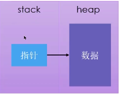

# Rust入门

* ***Fira Code，等宽的编程连字字体***
* Rust 的缩进是4个空格，不是tab
* println! 是一个Rust macro(宏)
  * 如果是函数则没有!

## Cargo

> Rust的构建系统和包管理工具

1. cargo --version
2. 创建项目: cargo new hello_cargo
   1. 创建库项目: cargo new encrypt --lib
3. 构建项目: cargo build
4. 构建运行: cargo run
5. 发布构建: cargo build --release

## TOML

> TOML 这个名字是 Tom's Obvious, Minimal Language（汤姆的浅显的、极简的语言）的首字母略写词

## 语法

* 定义常量
  * `const MAX_POINT:i32 = 1099;`
    * 变量名大写
    * 指定类型
* shadowing
  * 使用相同的名字声明新的变量，新的变量就会shadow之前声明的同名变量
* 标量类型
  * 整数类型
  * 浮点类型
  * 布尔类型
  * 字符类型
* 复合类型
  * 长度固定
  * Tuple
    * 将多个类型的多个值放在一个类型里
    * ```rust
      let tup_set: (i32, f64, u8) = (200, 4.4, 1);
      println!("{} - {} - {}", tup_set.0, tup_set.1, tup_set.2);

      let (x, y, z) = tup_set;
      println!("{} - {} - {}", x, y, z);
      ```
  * 数组
    * 如果想让数据存放在栈上而不是堆上，或者保证有固定数量的元素时用数组
    * 数组没有Vector（标准库提供的）灵活
    * Vector长度可以改变
    * ```rust
      let a = [3;5];
      let b = [3,3,3,3,3];
      let first = a[0];
      ```
* 函数
  * 用关键字 fn
  * snake case
  * ```rust
    fn ano_func(x: i32) { //parameter 必须指定参数类型
        println!("{}", x);
    }
    //
    ano_func(3); //argument

    ///////////////////////////
    fn main() {
        let x = plus_five(4);
        println!("{}", x);
    }

    fn plus_five(x: i32) -> i32 {
        x + 5  //这里不能有分号，否则意义会变
    }
    ```
* 注释
* 控制流
  * if表达式
    * 根据条件（bool）执行不同代码分支
    * 与条件相关联的代码块叫分支（arm）
  * 循环
    * loop
    * while
    * for

## 所有权

* Rust的核心特性就是所有权
* 所有程序在运行时都必须管理它们使用计算机内存的方式
  * 有些语言有垃圾手机机制
  * 有些语言，程序员必须显式地分配和释放内存
* Rust采用另一种方式
  * 通过一个所有权系统来管理，其中包含一组编译器在编译时检查的规则
  * 当程序运行时，所有权特性不会减慢程序的运行速度
* 所有权解决的问题
  * 跟踪代码的那些部分正在使用heap的那些数据
  * 最小化heap上的重复数据量
* 内存和分配
  * 当拥有它的变量走出作用域时，内存会立即自动的交还给操作系统
  * **drop函数**
* 变量和数据交互的方式
  * move
    * 多个变量可以与同一个数据使用一种独特的方式来交互
    * ```
      let x = 5;
      let y = x; //创建了一个x的副本，并绑定到y上
      ```
    * String堆对象

      * 三部分组成（在stack上）
        * 指向存放字符串内容的内存指针（字符串内容在heap上）
        * 一个长度（存放字符串内容所需的字节数）
        * 一个容量（String从操作系统总共获得的内存的总字节数）
        * 
        * 
        * 
  * 你也许会将复制指针、长度、容量视为浅拷贝，但由于Rust 让s1失效了，所以我们用一个新的术语：Move
  * Rust不会自动创建数据的深拷贝
  * 如果想对heap上面的string数据进行深度拷贝，而不仅仅是stack上的数据，可以使用clone方法
* stack上的数据：复制
  * Copy trait，可以用于像整数这样完全存放在stack上面的类型
  * 如果一个类型实现了copy这个trait，那么旧的变量在赋值后仍然可用
  * 如果一个类型或者该类型的一部分实现了Drop trait，那么Rust不允许让它再去实现copy trait
* 一些拥有Copy trait的类型
  * 任何简单标量的组合类型都可以**是**copy的
  * 任何需要分配内存或某种资源的都**不是**copy的
  * 拥有copy trait的类型
    * 所有的整数类型
    * bool
    * char
    * 所有的浮点类型
    * Tuple，如果其所有的字段都是copy的
      * （i32，i32）是
      * （i32，String）不是

## 所有权与函数

> 将值传递给函数将发生***移动***或***复制***

## 返回值与作用域

> 函数在返回值的过程中同样会发生所有权的转移

## 如何让函数使用某个值，但不获得其所有权

```rust
fn main() {
    let s1 = String::from("hello");
    let (s2, len) = calculate_length(s1);
    println!("The length of '{}' is {}", s2, len);
}

fn calculate_length(s: String) -> (String, usize) {
    let len = s.len();
    (s, len)
}
```

> 推荐方式

```rust
fn main() {
    let s1 = String::from("hello");
    let len = calculate_length(&s1);
    println!("The length of '{}' is {}", s1, len);
}

fn calculate_length(s: &String) -> usize {
    s.len()
}
```

* 引用和借用
  * &符号表示引用，允许引用某些值而不取得其所有权
  * 把引用作为函数参数这个行为叫做借用\

## 切片

* 切片
  * 不持有所有权的数据类型：***slice***

## 字符串

* 字符串切片
  * > 指向字符串中一部分内容的引用
    >
* **字符串切片和字符串引用关系**
  * > ***Rust使用解引用强制转换（deref coercion），把String引用转化成字符串切片***
    >
* ```rust
  fn main() {
      let s = String::from("Hello World");

      let hello = &s[0..5];
      // let hello = &s[..5];

      // let world = &s[6..11];
      // let world = &s[6..];
      let world = &s[6..s.len()];
      println!("{}, {}", hello, world);
  }
  ```
* ```rust
  fn main() {
      let s = String::from("Hello World");
      let fist_word = first_word(&s);
      println!("first word is: {}", fist_word);
  }

  fn first_word(s: &String) -> &str {
      let bytes = s.as_bytes();
      for (i, &item) in bytes.iter().enumerate() {
          if item == b' ' {
              return &s[..i];
          }
      }
      &s[..]
  }
  ```
* **字符串字面值是切片**
  * `let s: &str = "good";`
  * 字符串字面值被直接存储在二进制程序中
* 如果*方法参数*是**String引用**建议改为字符串切片，因为这样方法兼容字符串和切片
  * ```rust
    fn main() {
        let string_object = String::from("Hello World");
        let string_first = first_word(&string_object[..]);
        println!("{}", string_first);

        let string_literal = "Hello World";
        let literal_first = first_word(string_literal);
        println!("{}", literal_first);
    }

    fn first_word(s: &str) -> &str {
        let bytes = s.as_bytes();
        for (i, &item) in bytes.iter().enumerate() {
            if item == b' ' {
                return &s[..i];
            }
        }
        &s[..]
    }
    ```
* 更新字符串
  * push_str 方法 把一个字符串切片附加到String
  * push() 把单个字符附加到String
  * \+
    * 使用了类似这个签名的方法 fn add(self, s: &str) -> String { ... }
      * 标准库中的add方法是用了泛型
      * 只能把&str添加到String
      * 解引用强制转换
  * format!
    * 和println!()类似，但返回字符串
    * 不会获得参数的所有权
* 内部表示
  * String是对 `Vec<u8>`的包装
* Rust看待字符串的方式
  1. 字节: bytes()方法
  2. 标量值: chars()方法
  3. 字形簇（最接近所谓的“字母”）

## struct

* 作为函数返回值

## Tuple struct

> black和origin是不同的类型，是不同tuple struct的实例

```rust
fn main() {
    let black = Color(0, 0, 0);
    let origin = Point(0, 0, 0);
}

struct Color(i32, i32, i32);
struct Point(i32, i32, i32);
```

## struct 例子

```rust
#[derive(Debug)]
struct Rectangle {
    width: u32,
    length: u32,
}

fn main() {
    let rect = Rectangle {
        width: 30,
        length: 50,
    };
    println!("{}", area(&rect));
    println!("{:#?}", rect);
}

fn area(rect: &Rectangle) -> u32 {
    rect.length * rect.width
}

```

## struct 的方法

> 方法和函数不同之处

1. 方法是在struct的上下文中定义
2. 第一个参数是self，表示方法被调用的struct实例
3. ```rust
   #[derive(Debug)]
   struct Rectangle {
       width: u32,
       length: u32,
   }

   impl Rectangle {
       fn area(&self) -> u32 {
           self.length * self.width
       }
   }

   fn main() {
       let rect = Rectangle {
           width: 30,
           length: 50,
       };
       println!("{}", rect.area());
       println!("{:#?}", rect);
   }

   ```

* 关联函数
  * 在impl块里定义不把self作为第一个参数的函数，他们叫关联函数（不是方法）
    * 例如：String::from()
  * 关联函数通常用于构造器

## match

## 代码组织


模块系统：

* Package：Cargo的特性，让你构建、测试、共享crate
  * 相当于**工程目录**
* Crate：一个模块树，它可产生一个library或可执行文件
  * binary
  * library
  * 相当于***类文件***
  * src/main.rs 是binary crate的crate root
  * src/lib.rs 是library crate的crate root
* Module、use：控制代码的组织、作用域、私有路径
* Path：为struct、function或module等项命名的方式

## 所有权和借用规则

* 不能在同一作用域内同时拥有可变和不可变引用
  * 
  * situation_a正确运行，但是situation_b报错，因为v.push之后v已不是之前的v，而println再次使用first，first内存区域仍旧是之前v的

## HashMap

```rust
use std::{collections::HashMap, vec};

fn main() {
    let teams = vec![String::from("Blue"), String::from("Yellow")];
    let scores = vec![10, 50];

    let scores_map: HashMap<_, _> = teams.iter().zip(scores.iter()).collect();
    for ele in scores_map.iter().enumerate() {
        let a_0 = ele.0;
        let key = ele.1.0;
        let val = ele.1.1;
        println!("{} - {} - {}", a_0, key, val);
    }
}
```

* HashMap和所有权

  * 对于实现了Copy trait的类型（例如 i32），***值会被复制到HashMap中***
  * 对于拥有所有权的值（例如 String），值会被移动，***所有权会转移给HashMap***
  * 如果将值的引用插入到HashMap，值本身不会移动
* entry(key) 方法

  * 检查指定的K是否对应一个V
    * 参数K
    * 返回enum Entry 代表值是否存在
  * ```rust
    key存在
    Entry(
        OccupiedEntry {
            key: "Blue",
            value: 10,
            ..
        },
    )
    key不存在
    Entry(
        VacantEntry(
            "Red",
        ),
    )
    ```
* Entry的 or_insert() 方法

  * 返回
    * 如果K存在，返回 ***到对应的V的一个可变引用***
    * 如果K不存在，将方法参数作为K的新值插进去，返回 ***到这个值的可以引用***

## Rust 错误处理概述

* Rust 没有类似异常的机制
  * 可恢复错误，Result<T, E>
  * 不可恢复：panic! 宏
    * 当执行panic!宏时候
      * 你的程序会打印一个错误信息
      * 展开（unwind）、清理调用栈（stack）
        * 展开调用栈（工作量大）
          * Rust沿着调用栈往回走
          * 清理每个遇到的函数中的数据
        * 立即中止调用栈
          * 不进行清理，直接停止程序
          * 内存需要OS进行清理
      * 退出程序
  * 想让二进制文件更小，把设置从”展开“ 改为 ”中止“
    * 在Cargo.toml 中适当的profile部分设置
      * panic='abort'
      * ```toml
        [profile.release]
        panic = 'abort'
        ```

## Result 枚举

```
enum Result<T, E> {
    Ok(T),
    Err(E),
}
T: 操作成功情况下，OK变体里返回的数据的类型
E: 操作失败情况下，Err变体里返回的错误的类型
```

* unwrap
* expect
* ?运算符只能用于返回Result的函数
* main函数的返回类型是: ()
* main函数的返回类型也可以是: Result<T, E>
  * ```rust
    use std::{error::Error, fs::File};

    fn main() -> Result<(), Box<dyn Error>> {
        let f: File = File::open("hello.txt")?;
        //let f: Result<File, std::io::Error> = File::open("hello.txt");
        Ok(())
    }
    ```
* `Box<dyn Error> 是trait对象`
  * 简单理解：”任何可能的错误类型“

## 提取函数

```rust
fn main() {
    let num_list = vec![34, 54, 66, 100, 75];
    largest_pattern_match(&num_list);
    largest(&num_list);

    let num_list = vec![34, 54, 66, 100, 75, 102, 5000];
    largest_pattern_match(&num_list);
    largest(&num_list);
}

//only works with Copy types
fn largest_pattern_match(arr: &[i32]) -> i32 {
    let mut temp: i32 = arr[0];
    for &num in arr { //&num 模式匹配
        if num > temp {
            temp = num;
        }
    }
    println!("The largest number is {}", temp);
    temp
}

// works with both Copy and non-Copy types
fn largest(list: &[i32]) -> i32 {
    let mut largest = list[0];

    for item in list {
        if *item > largest {
            largest = *item;
        }
    }
    println!("The largest number is {}", largest);
    largest
}

```

## 泛型

* 泛型代码的性能
  * 使用泛型的代码和使用具体类型的代码运行速度是一样的
  * 单态化（monomorphization)
    * 在编译时将泛型替换为具体类型的过程

## Trait

> Trait告诉Rust编译器：某种类型具有哪些并且可以与其他类型共享的功能
>
> Trait：抽象的定义共享行为
>
> Trait bounds（约束）
>
> Trait与其他语言的接口（interface）类似，但有些区别

* 定义一个trait

  * 把方法签名放在一起，来定义实现某种目的所必须的一组行为
    * 关键字：trait
    * 只有方法签名，没有具体实现
    * trait可以有多个方法；每个方法签名占一行，以；结尾
    * 实现该trait的类型必须提供具体的方法实现
* lib.rs

  * ```rust
    pub trait Sumary {
        fn summarize(&self) -> String;
    }

    pub struct NewsArticle {
        pub headline: String,
        pub location: String,
        pub author: String,
        pub content: String,
    }

    impl Sumary for NewsArticle {
        fn summarize(&self) -> String {
            format!("{}, by {} ({})", self.headline, self.author, self.location)
        }
    }

    pub struct Tweet {
        pub username: String,
        pub content: String,
        pub reply: bool,
        pub retweet: bool,
    }

    impl Sumary for Tweet {
        fn summarize(&self) -> String {
            format!("{}: {}", self.username, self.content)
        }
    }

    ```
* main.rs

  * ```rust
    // hello_world_rust是cargo.toml中的包名
    use hello_world_rust::Sumary;
    use hello_world_rust::NewsArticle;
    use hello_world_rust::Tweet;


    fn main() {
        let tweet = Tweet {
            username: String::from("horse_ebooks"),
            content: String::from("of couse, as you probably already know, people"),
            reply: false,
            retweet:false,
        };
        println!("{}", tweet.summarize());

        let article = NewsArticle {
            content: String::from("地铁和施工架子撞了，很严重"),
            headline: String::from("上海地铁撞车了"),
            location: String::from("上海"),
            author: String::from("lyle"),
        };
        println!("{}", article.summarize());

    }

    ```

## 生命周期

* Rust 的每个引用都有自己的生命周期
* 生命周期：引用保持有效的作用域
* 大多数情况：生命周期是隐士的，可被推断的
* 当引用的生命周期可能以不同的方式互相关联时：手动标注生命周期
* ```rust
  fn main() {
      let s1 = String::from("abcd");
      let s2 = "xyz";

      let result = longest(&s1, &s2);
      println!("{}", result);
      println!("{}", s1);
      println!("{}", s2);
  }

  fn longest<'a>(x: &'a str, y: &'a str) -> &'a str {
      if x.len() > y.len() {
          x
      } else {
          y
      }
  }

  ```

### 生命周期标注语法

* 生命周期的标注不会改变引用的生命周期长度
* 当指定了泛型生命周期参数，函数可以接收带有任何生命周期的引用
* 生命周期的标注：描述了多个引用的生命周期的关系，但不影响生命周期
* 标注语法
  * 以 ' 开头
  * 通常全小写且非常短
  * 很多人使用 'a
* 标注的位置
  * 在引用的&符号后
  * 使用空格将标注和引用类型分开
    * （&i32 -> &'a i32）带有显式生命周期的引用
    * （&'a mut i32） 带有显式生命周期的可变引用
    * 单个生命周期标注本身没有意义

> **如果函数返回的引用没有指向任何参数，那么它只能引用函数内创建的值，**
>
> **这就是悬垂引用：该值在函数结束时就走出了作用域**

### 生命周期省略的三个规则

> 编译器使用3个规则在没有显式标注生命周期的情况下，来确定引用的生命周期

1. 规则1：每个引用类型的参数都有自己的生命周期
   1. 应用于**输入**生命周期
2. 规则2：如果只有一个输入生命周期参数，那么该生命周期被赋给所有的输出生命周期参数
   1. 应用于**输出**生命周期
3. 规则3：如果有多个输入生命周期参数，但其中一个是&self或&mut self（***是方法***），那么self的生命周期会被赋给所有的输出生命周期参数
   1. 应用于**输出**生命周期
4. 如果编译器应用完3个规则之后，仍然有无法确定生命周期的引用->报错
5. 这些规则适用于fn定义和impl块

### 静态生命周期

> 'static 是一个特殊的生命周期：整个程序的持续时间

* 所有的字符串字面值都拥有 'static 生命周期

  * `let a: &'static str = "good";`

## 测试

> 测试函数需要使用test属性（attribute）进行标注

* Attribute就是一段Rust代码的元数据
* 在函数上加 #[test] 可以把函数变成测试函数

> cargo test  命令运行所有测试函数

## 测试的分类

### 单元测试

* 小、专注
* 一次对一个模块进行隔离的测试
* 可测试private接口

> tests模块上的 #[cfg(test)] 标注：
>
> * 只有运行cargo test 才**编译**和**运行**代码
> * 运行cargo build 则不会

### 集成测试

* 在库外部。和其它外部代码一样使用你的代码
* 集成测试在不同的目录，它***不需要*** #[cfg(test)] 标注
* 创建集成测试 tests 目录
* tests目录下的每个测试文件都是单独的一个crate
* 只有cargo test 才会编译tests目录

### cfg: configuration

> * 告诉Rust下面的条目只有在指定的配置选项下才被包含
> * 配置项test，用来编译和运行测试

### 针对binary crate的集成测试

> 如果项目是binary crate， 只含有src/main.rs 没有 src/lib.rs
>
> * 不能在tests目录下创建集成测试
> * 无法把main.rs的函数导入作用域
> * 只有library crate才能暴露函数给其他crate用
> * binary crate意味着独立运行

## 文档

`cargo doc --open`

> lib.rs
>
> * 注意 ` ``` 符号 `

```rust
/// 给定数组加上1
///
/// # Examples
/// ```
/// let arg = 5;
/// let answer = encrypt::add_one(arg);
///
/// assert_eq!(6, answer);
/// ```
pub fn add_one(x: i32) -> i32 {
    x + 1
}

```

## 不使用cargo，直接命令编译，依赖库文件

1. 让我们创建一个库，然后看看如何把它链接到另一个 crate。
   1. 创建文件名为 mylib.rs
   2. ```rust
      pub fn public_function() {
          println!("called rary's `public_function()`");
      }

      fn private_function() {
          println!("called rary's `private_function()`");
      }

      pub fn indirect_access() {
          print!("called rary's `indirect_access()`, that\n> ");

          private_function();
      }
      ```
   3. ```bash
      rustc --crate-type=lib mylib.rs
      # 默认情况下，库会使用 crate 文件的名字，前面加上 “lib” 前缀，但这个默认名称可以使用 crate_name 属性 覆盖
      ```
2. 使用上述库
   1. 创建文件名 executable.rs
   2. ```rust
      // extern crate rary; // 在 Rust 2015 版或更早版本需要这个导入语句

      fn main() {
          rary::public_function();

          // 报错！ `private_function` 是私有的
          //rary::private_function();

          rary::indirect_access();
      }

      ```
   3. ```bash
      # libmylib.rlib 是已编译好的库的路径，这里假设它在同一目录下：
      rustc executable.rs --extern rary=libmylib.rlib --edition=2018 && ./executable
      ```
   4. [参考地址](https://rustwiki.org/zh-CN/rust-by-example/crates/using_lib.html)

## 接受命令行参数

> cargo run searchStr target.txt

## 二进制程序关注点分离的指导性原则

1. 将程序拆分为main.rs和lib.rs，将业务逻辑放入lib.rs
2. 当命令行解析逻辑较少时，将它放在main.rs也行
3. 当命令行解析逻辑变复杂时，需要将它从main.rs提取到lib.rs

## 闭包

> 可以捕获其所在环境的匿名函数

#### 闭包

* 是匿名函数
* 保存为变量，作为参数
* 可在一个地方创建闭包，然后在另一个上下文中调用闭包来完成运算
* 可从其定义的作用域捕获值
  * 闭包可以访问定义它的作用域内的变量，普通函数则不能
  * 会产生内存开销

#### 闭包类型推断

* 闭包不要求标注参数和返回值类型
* 闭包通常很短小，只在狭小的上下文中工作，编译器通常能推断出类型
* 可以手动添加类型标注
* 注意：闭包的定义最终只会为参数/返回值推断出***唯一具体的类型***

#### Fn trait

* Fn traits 由标准库提供
* 所有闭包都至少实现了以下trait之一：
  * Fn
    * 当指定Fn trait bound之一时，首先用Fn,
  * FnMut
  * FnOnce

#### 闭包从所在环境捕获值的方式

* 取得所有权：FnOnce
* 可变借用：FnMut
* 不可变借用：Fn

##### move关键字

> 在参数列表前使用move关键字，可以强制闭包取得它所使用的环境值的所有权
>
> * 当将闭包传递给新线程以移动数据使其归新线程所有时，此技术最为有用

## 迭代器

* iter方法：在不可变引用上创建迭代器
* into_iter方法：创建的迭代器会获得所有权
* iter_mut方法：迭代可变的引用


## for vs iterator

> 迭代器版本更快一些
>
> * Zero-Cost Abstraction(零开销抽象)
> * 使用抽象时不会引入额外的运行时开销


## cargo


#### pub use

> * 麻烦: my_crate::some_module::another_module::UsefulType;
> * 方便: my_crate::UsefulType;
> * 解决办法
>   * 使用pub use: 可以重新导出，创建一个与内部私有结构不同的对外公共结构


#### 发布crate

> 需要在Cargo.toml的 [package] 区域为 crate 添加一些元数据
>
> * crate 需要唯一的名称： name
> * description：一两句话即可，会出现在crate搜索的结果里
> * license：可以指定多个，用 OR
> * version
> * author
> * 发布： cargo publish
> * yank一个版本
>   * cargo yank --vers 1.0.1
> * 取消yank
>   * cargo yank --vers 1.0.1 --undo


## 工作空间（workspace）

> 比如：一个二进制crate， 2个库crate
>
> * 二进制crate：main函数依赖于其他2个库crate
> * 一个库crate提供 add_one函数
> * 另一个库crate提供add_two函数


### 运行指定的crate

`cargo run -p crateName`

### 安装二进制crate

> cargo install xxx


## 智能指针

* 指针：一个变量在内存中包含的是一个地址
* Rust中最常见的指针就是“引用”
  * 使用&
  * 借用它指向的值
  * 没有其余开销
* 智能指针是这样一些数据结构：
  * 行为和指针相似
  * 有额外的元数据和功能
  * ***引用计数***智能指针类型
    * 记录所有者的数量，使一份数据被多个所有者同时持有
    * 并在没有任何所有者时自动清理数据

### 引用和智能指针的其他不同

> 引用： 只借用数据
>
> 智能指针：很多时候都拥有他所指向的数据


### `Box<T>是最简单的智能指针`

* 允许在heap上存储数据（而不是stack）
* 
* 没有性能开销
* 没有其他额外功能
* 实现了Deref trait和Drop trait
* **只提供了“间接”存储和heap内存分配的功能**

### Deref Trait

* 实现Deref trait 使我们可以***自定义解引用运算符*的行为***
* 通过实现Deref，智能指针可***像常规引用一样来处理***


### MyBox

```rust
use std::ops::Deref;

struct MyBox<T>(T);

impl<T> MyBox<T> {
    fn new(x: T) -> MyBox<T> {
        MyBox(x)
    }
}

impl<T> Deref for MyBox<T> {
    type Target = T;

    fn deref(&self) -> &T {
        &self.0
    }
}

fn main() {
    let x = 5;
    let y = MyBox::new(x);

    assert_eq!(5, x);
    assert_eq!(5, *y);
    assert_eq!(5, *(y.deref()));
}

```


### 函数和方法的隐式解引用转换（Deref Coercion）

* 隐式解引用转化是为函数和方法提供的一种便捷特性
* 假设T实现了Deref trait
  * Deref Coercion可以把***T的引用***转化为***T经过Deref 操作后生成的引用***
* 当把某类型的引用传递给函数或方法时，但它的类型与定义的参数类型不匹配
  * Deref Coercion就会自动发生
  * 编译器会对deref进行一系列调用，来把它转为所需的参数类型
    * 在编译时完成，没有额外性能开销


### Drop trait

> 实现Drop trait， 可以让我们自定义***当值将要离开作用域时发生的动作***
>
> * 例如：文件、网络资源释放
> * 任何类型都可以实现Drop trait

* Drop trait只要求实现drop方法
  * 参数：对self的可变引用
* Drop trait在预导入模块里（prelude）
* Rust不允许手动调用Drop trait的drop方法
* 但可以调用标准库的std::mem::drop函数，来提前drop值


### `RC<T>引用计数智能指针`


### Rc::clone() vs 类型的clone()方法

> * Rc::clone() 增加引用，不会执行数据的深度拷贝操作
> * 类型的clone() 很多会执行数据的深度拷贝操作


###  `使用RefCell<T>在运行时记录借用信息`

* 两个方法（安全接口）
  * borrow方法
    * 返回智能指针 `Ref<T>`,它实现了Deref
  * borrow_mut方法
    * 返回智能指针 `RefMut<T>`,它实现了Deref
* `RefCell<T> 会记录当前存在多少个活跃的Ref<T>和RefMut<T>智能指针`
  * 每次调用borrow：不可变借用计数加1
  * 任何一个 `Ref<T>`的值离开作用域被释放时：不可变借用计数减1
  * 每次调用borrow_mut: 可变借用计数加1
  * 任何一个 `RefMut<T>`的值离开作用域被释放时：可变借用计数减1


## 防止内存泄露的解决办法

* 依靠开发者来保证，不能依靠Rust
* 重新组织数据结构：一些引用来表达所有权，一些引用不表达所有权
  * 循环引用中的一部分具有所有权，另一部分不涉及所有权关系
  * 只有所有权关系才影响值的清理
  * 把 `Rc<T>`换成 `Weak<T>`
    * Rc::clone为 `Rc<T>`实例的strong_count加1，`Rc<T>`的实例只有在strong_count为0的时候才会被清理
    * `Rc<T>`实例通过调用Rc::downgrade方法可以创建值的Weak Reference
      * 返回类型是 `Weak<T>`（智能指针）


### Strong vs Weak

> * Strong Reference是关于如何分享 `Rc<T>`实例的所有权
> * Weak Reference并不表达上述意思
> * 使用Weak Reference并不会创建循环引用
>   * 当strong reference数量为0的时候，Weak reference会自动断开
> * 在使用 `Weak<T>`前，需保证它指向的值仍然存在
>   * 在 `Weak<T>`实例上调用upgrade方法，返回 `Option<Rc<T>>`


## Send 和 Sync trait

> Rust语言中有两个并发概念：std::marker::Sync 和 std::marker::Send 标签trait

#### send：允许线程间转移所有权

> * 实现Send trait的类型可在线程间转移所有权
> * Rust中几乎所有类型都实现了Send
>   * `Rc<T>`没有实现Send，它只用于单线程情景
> * 任何完全由Send类型组成的类型也被标记为Send
> * 除了原始指针之外，几乎所有的基础类型都是Send

#### Sync:运行从多线程访问

> * 实现流量Sync的类型可以安全的被多个线程引用
> * 也就是说：如果T是sync，那么&T就是send
>   * 引用可以被安全的送往另一个线程
> * 基础类型都是Sync
> * 完全由Sync类型组成的类型也是Sync
>   * 但，`Rc<T>`不是Sync的
>   * `RefCell<T>`和 `Cell<T>`家族也不是Sync的


#### 手动来实现Send和Sync是不安全的


## Rust的面向对象编程特性

* 封装
  * pub
* 继承
  * Rust没有继承
  * 继承的目的
    * 代码复用
      * 默认trait方法来进行代码共享
    * 多态
      * 泛型和trait约束
* 很多新语言都不使用继承作为内置的程序设计方案了


### trait对象必须保证对象安全

> * 只能把满足对象安全（object-safe）的trait转化为trait对象
> * Rust采用一些列规则来判定某个对象是否安全，只需记住两条
>   * 方法的返回类型不是self
>   * 方法中不包含任何泛型类型参数


## 模式

> * 模式是Rust中的一种特殊语法，用于匹配复杂和简单类型的结构
> * 将模式与匹配表达式和其他构造结合使用，可以更好地控制程序的控制流
> * 模式由以下元素（的一些组合）组成
>   * 字面值
>   * 解构的数组、enum、struct、tuple
>   * 变量
>   * 通配符
>   * 占位符
> * 想要使用模式，需要将其与某个值进行比较
>   * 如果模式匹配，就可以在代码中使用这个值的相应部分


### match的Arm

```rust
match Value {
    pattern => Expression,
    pattern => Expression,
    pattern => Expression,
}
```

* match表达式的要求
  * 详尽
* 一个特殊的模式： _(下划线)
  * 它会匹配任何东西
  * 不会绑定到变量
  * 通常用于match的最后一个arm；或用于忽略某些值


### 条件if let表达式

* if let表达式主要是作为一种简短的方式来等价的代替只有一个匹配项的match
* if let可选的可以拥有else，包括
  * else if
  * else if let
* 但，if let不会检查穷尽性


### while let 条件循环

* 只要模式继续满足匹配的条件，那它运行while循环一直运行


### for

* for循环是Rust中最常见的循环
* for循环中，***模式就是紧随for关键字后的值***


### let

* let语句也是模式
* let pattern = expression;

### 函数参数

* 函数参数也可以是模式


### 多重模式

> 在match表达式中，使用 | 语法（或）可以匹配多种模式

> ..=  来匹配某个范围的值

### 解构以分解值

* 可以使用模式来解构struct、enum、tuple，从而引用这些类型值的不同部分


## Unsafe Rust

> Unsafe Rust存在的原因
>
> * 静态分析是保守的
>   * 使用unsafe rust，我们知道自己在做什么，并承担相应风险
> * 计算机硬件本身就是不安全的，Rust需要能够进行底层系统编程

### Unsafe超能力

> Unsafe Rust里可执行的四个动作
>
> 1. 解引用原始指针
> 1. 调用unsafe函数或方法
> 1. 访问或修改可变的静态变量
> 1. 实现unsafe trait


### 常量和不可变静态变量的区别

* 静态变量：有固定的内存地址，使用它的值总会访问同样的数据
* 常量：允许使用它们的时候对数据进行复制
* 静态变量：可以是可变的，访问和修改静态可变变量是不安全（unsafe）的


### 在trait定义中使用关联类型来指定占位类型

> 关联类型（associated type)是Trait中的类型占位符


### 类型别名

> 使用type 关键字
>
> `type kilometers = i32;`
>
> `type thunk  = Box<dyn Fn() + send + 'static>;`


### Never类型


## 宏
